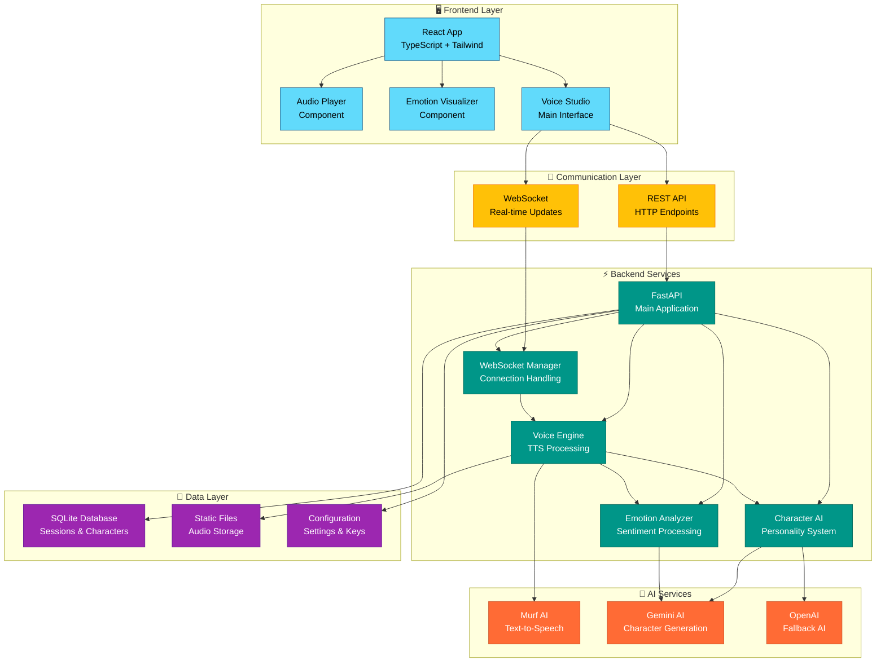

# 🎭 VoiceForge - AI Voice Acting Studio

[](https://python.org)
[](https://fastapi.tiangolo.com)
[](https://reactjs.org)
[](https://typescriptjs.org)
[](https://developer.mozilla.org/en-US/docs/Web/API/WebSockets_API)

> 🚀 **Transform text into expressive voice acting with AI-powered emotion analysis and character voices**

VoiceForge is a cutting-edge AI voice acting studio that combines advanced emotion analysis, character AI, and text-to-speech technology to create dynamic, emotionally-aware voice performances. Perfect for content creators, game developers, and storytellers.

---

## ✨ Features

### 🎤 **Advanced Voice Generation**
- **Murf AI Integration**: Professional-quality text-to-speech
- **Real-time Processing**: WebSocket-based streaming
- **Fallback System**: Graceful degradation when APIs are unavailable
- **Multiple Formats**: MP3, WAV, OGG support

### 🎭 **Character System**
- **Pre-built Characters**: Hero, Villain, Narrator with unique voices
- **Character AI**: Gemini/OpenAI-powered personality generation
- **Voice Modulation**: Speed, pitch, and tone adjustments
- **Dynamic Dialogue**: AI-generated character-appropriate speech

### 🧠 **Emotion Analysis**
- **Real-time Sentiment**: Advanced keyword and pattern analysis
- **Voice Modifiers**: Automatic speed/pitch adjustment based on emotion
- **Visual Feedback**: Interactive emotion breakdown charts
- **Confidence Scoring**: Analysis reliability indicators

### 🌐 **Modern Architecture**
- **FastAPI Backend**: High-performance async Python API
- **React Frontend**: Modern TypeScript interface
- **WebSocket Communication**: Real-time bidirectional updates
- **RESTful Endpoints**: Standard HTTP API for integration

---

## 🏗️ System Architecture



---

## 🚀 Quick Start

### Prerequisites
- **Python 3.8+** 📐
- **Node.js 16+** 🟢
- **API Keys** (Optional but recommended):
  - [Murf AI API Key](https://murf.ai) 🎤
  - [Google Gemini API Key](https://ai.google.dev) 🧠
  - [OpenAI API Key](https://openai.com) 🤖

### 1️⃣ Clone & Setup

```bash
# Clone the repository
git clone https://github.com/yourusername/voiceforge.git
cd voiceforge

# Create virtual environment
python -m venv venv
source venv/bin/activate  # Windows: venv\Scripts\activate

# Install dependencies
pip install -r requirements.txt
```

### 2️⃣ Environment Configuration

Create a `.env` file in the project root:

```env
# API Keys (Optional - app works in fallback mode without them)
MURF_API_KEY=your_murf_api_key_here
GEMINI_API_KEY=your_gemini_api_key_here
OPENAI_API_KEY=your_openai_api_key_here

# Server Configuration
HOST=127.0.0.1
PORT=8000
SERVER_URL=http://localhost:8000

# Database
DATABASE_URL=sqlite:///./voiceforge.db

# Security
SECRET_KEY=your-secret-key-change-in-production
```

### 3️⃣ Install Frontend Dependencies

```bash
# Navigate to frontend directory
cd frontend

# Install Node.js dependencies
npm install

# Or with yarn
yarn install
```

### 4️⃣ Start the Application

**Backend (Terminal 1):**
```bash
# From project root
python -m uvicorn main:app --reload --host 127.0.0.1 --port 8000
```

**Frontend (Terminal 2):**
```bash
# From frontend directory
cd frontend
npm start

# Or with yarn
yarn start
```

### 5️⃣ Access the Application

- 🌐 **Frontend**: http://localhost:3000
- 📡 **Backend API**: http://localhost:8000
- 📚 **API Docs**: http://localhost:8000/docs
- 🔍 **Health Check**: http://localhost:8000/health

---

## 📂 Project Structure

```
voiceforge/
├── 📁 app/                     # Backend application
│   ├── 📁 api/
│   │   └── routes.py          # REST API endpoints
│   ├── 📁 core/
│   │   ├── config.py          # Configuration settings
│   │   └── websocket_manager.py # WebSocket handling
│   ├── 📁 models/
│   │   └── database.py        # SQLAlchemy models
│   └── 📁 services/
│       ├── character_ai.py    # Character generation
│       ├── emotion_analyzer.py # Sentiment analysis
│       └── voice_engine.py    # TTS processing
├── 📁 frontend/               # React application
│   ├── 📁 src/
│   │   ├── 📁 components/
│   │   │   ├── AudioPlayer.tsx
│   │   │   ├── EmotionVisualizer.tsx
│   │   │   └── VoiceStudio.tsx
│   │   └── App.tsx
│   └── package.json
├── 📁 static/                # Static file storage
│   └── 📁 audio/             # Generated audio files
├── main.py                   # FastAPI entry point
├── requirements.txt          # Python dependencies
├── .env.example             # Environment template
└── README.md               # This file
```

---

## 🎯 API Reference

### 🔌 WebSocket Endpoints

#### `/ws/{session_id}`
Real-time voice generation and character interaction.

**Message Types:**
- `voice_request`: Generate speech from text
- `character_switch`: Change active character

### 🌐 REST Endpoints

#### `GET /health`
System health check and service status.

#### `GET /api/v1/voices`
Retrieve available voice configurations.

#### `GET /api/v1/characters`
Get character profiles and descriptions.

#### `POST /api/v1/generate-speech`
Generate speech from text with emotion analysis.

```json
{
  "text": "Hello, world!",
  "character_id": "hero"
}
```

#### `POST /api/v1/analyze-emotion`
Analyze text for emotional content.

```json
{
  "text": "I'm so excited about this project!"
}
```

---

## 🎨 Character Profiles

### 🦸 **Hero**
- **Voice**: Strong, confident male voice
- **Personality**: Brave, determined, inspirational
- **Use Cases**: Protagonists, motivational content

### 🦹 **Villain**
- **Voice**: Deep, controlled male voice
- **Personality**: Cunning, mysterious, menacing
- **Use Cases**: Antagonists, dramatic narration

### 📖 **Narrator**
- **Voice**: Clear, engaging female voice
- **Personality**: Wise, knowledgeable, guiding
- **Use Cases**: Storytelling, educational content

---

## 🛠️ Configuration

### 🎤 Voice Engine Settings
```python
# voice_engine.py
VOICES = {
    "hero": {
        "murf_voice_id": "en-US-maverick",
        "speed": 1.1,
        "pitch": 1.0
    }
}
```

### 🧠 Emotion Analysis
```python
# emotion_analyzer.py
EMOTION_KEYWORDS = {
    "happy": {
        "primary": ["happy", "joy", "excited"],
        "expressions": ["😊", "😄", "🎉"]
    }
}
```

---

## 🔧 Development

### 🚀 Running in Development Mode

```bash
# Backend with auto-reload
uvicorn main:app --reload --log-level info

# Frontend with hot reload
npm start
```

### 🧪 Testing

```bash
# Run backend tests
pytest

# Run frontend tests
npm test
```

### 📦 Building for Production

```bash
# Build frontend
npm run build

# Docker build (if Dockerfile exists)
docker build -t voiceforge .
```

---

## 🐛 Troubleshooting

### ❌ Common Issues

**Audio Playback Fails:**
- Check CORS settings in browser
- Verify Murf API key configuration
- Try opening audio URL directly

**WebSocket Connection Issues:**
- Ensure backend is running on port 8000
- Check firewall settings
- Verify WebSocket URL in frontend

**API Key Problems:**
- Validate API keys in `.env` file
- Check API quota and billing status
- Review service-specific documentation

### 🔍 Debug Mode

Enable detailed logging by setting:
```bash
export LOG_LEVEL=DEBUG
```

---

## 🤝 Contributing

We welcome contributions! Here's how to get started:

1. **Fork** the repository
2. **Create** a feature branch: `git checkout -b feature/amazing-feature`
3. **Commit** your changes: `git commit -m 'Add amazing feature'`
4. **Push** to the branch: `git push origin feature/amazing-feature`
5. **Open** a Pull Request

### 📋 Development Guidelines
- Follow PEP 8 for Python code
- Use TypeScript for frontend components
- Add tests for new features
- Update documentation as needed

---

## 🙏 Acknowledgments

- **[Murf AI](https://murf.ai)** - Professional text-to-speech API
- **[Google Gemini](https://ai.google.dev)** - Advanced language model
- **[FastAPI](https://fastapi.tiangolo.com)** - Modern Python web framework
- **[React](https://reactjs.org)** - Frontend UI library

---

## 📞 Support

- 🐛 **Issues**: [GitHub Issues](https://github.com/BhaveshChouhan01/VoiceForge/issues)
- 📚 **Docs**: [Documentation Site](https://docs.voiceforge.dev)

---

<div align="center">

**⭐ Star this repository if you found it helpful! ⭐**

Made with ❤️ by the VoiceForge Team

</div>